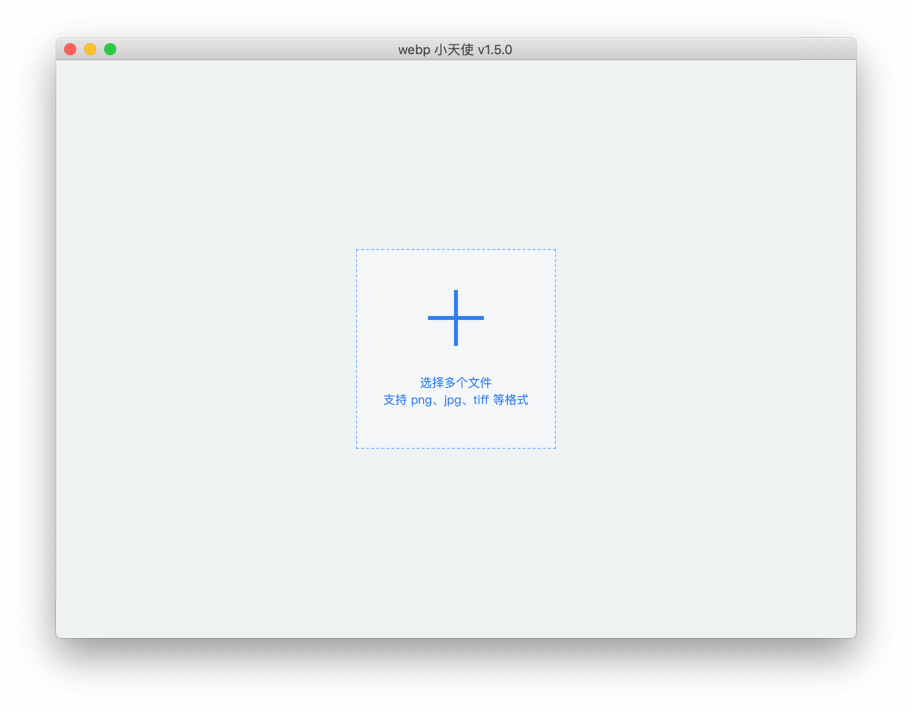
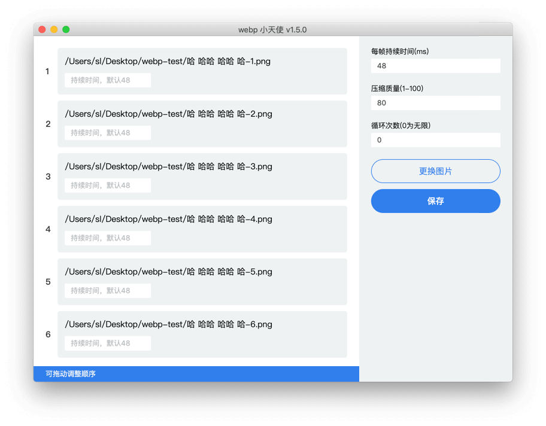

# webp-angle

你可能遇到过用其他工具生成的 webp 文件在安卓、ios、web等不同平台上表现不同的问题，那你可以尝试下本工具 `webp-angle`，一个无依赖、稳定、美观、易用的 webp 生成器，可以解决你用其他工具生成的 webp 在各种平台下表现不一的问题。

## 下载

点击 [Release](https://github.com/nervouself/webp-angle/releases) 进入下载。

## 使用

如 mac 遇到提示未知开发者的问题，请前往 系统偏好设置-安全性与隐私-通用，点击仍要打开

或在终端输入 `sudo spctl --master-disable` 并进入 系统偏好设置-安全性与隐私-通用，选择任何来源

    

    

注：win 平台路径中不要带空格，因为 cmd 对于引号的识别问题可能会导致报错。
